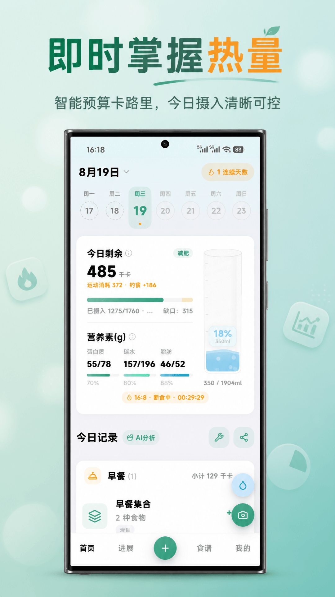

# App4U 推荐｜吃有数

> App4U 是我计划做的一个免费应用推荐项目，专注于分享独立开发者及小团队的优质作品。
>
> 因我本人也是从独立开发做起，深知流量获取之难，也常见很多独立开发者朋友苦于运营乏力，遂发起此项目，希望让更多用心、有创意的应用被看见，也希望给大家介绍一些好的作品。
>
> App4U **完全免费**，如您想投稿，可添加微信 litang0908（请备注 App4U 投稿）
> 
> 如您有喜欢的项目希望让更多人看到，也欢迎提供资料，感谢～

## 推荐语

吃有数是一款通过拍照识别卡路里的 App，通过 AI 来分析每一餐的热量，精准管理热量摄入，为注重饮食健康、控制体重的朋友提供一个便捷的方案。

---

## App 信息

吃有数：智能卡路里追踪，让健康管理更简单

### 核心功能：

- AI 智能识别：拍照即可识别食物，无需手动输入。
- 科学计算：基于 Mifflin-St Jeor 公式的个性化卡路里推荐，遵循营养学原理，提供精准建议。
- 个性化建议：根据身体数据提供定制化方案。
- AI 减法：饭前饭后拍一拍，只算出吃过的大致热量
- 经期预测：根据经期自动调节目标，更容易坚持下去
- 轻断食功能完全免费

### 应用截图：

### 支持的平台：

Android、iOS、HarmonyOS

### 收费方式：

- 注册即送 3 天会员
- 免费用户有一定使用额度
- 会员价格：半年 ¥35、一年 ¥68、两年 ¥98、永久会员 ¥128

### 补充信息

- [吃有数官网](https://chiyoushu.com)
- 小红书搜索「吃有数」

---

## 关于开发者

吃有数的作者 cmlanche 是独立开发者社区 w2solo.com 的发起人，我与他认识于2019年，彼时我俩都处于摸索独立开发的过程，如今他也陆续做了多款产品，除了吃有数，还有虾传(一款面向个人多设备的消息与文件发送工具，官网 xiachuan.net ，类似 LocalSend，开源)，有兴趣的朋友可以去体验。